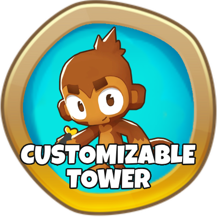

<h1 align="center">Customizable Tower</h1>

Adds a Completely Customizable Tower to The Game. You Can Customize it's Stats in The Config For The Mod.

Please don't use this in competitive modes, one: it could get your account flagged, and two: it ruins the fun for others.

<h1 aling="left"></h1>

<h2 align="center"> Join The Discord!</h2>

